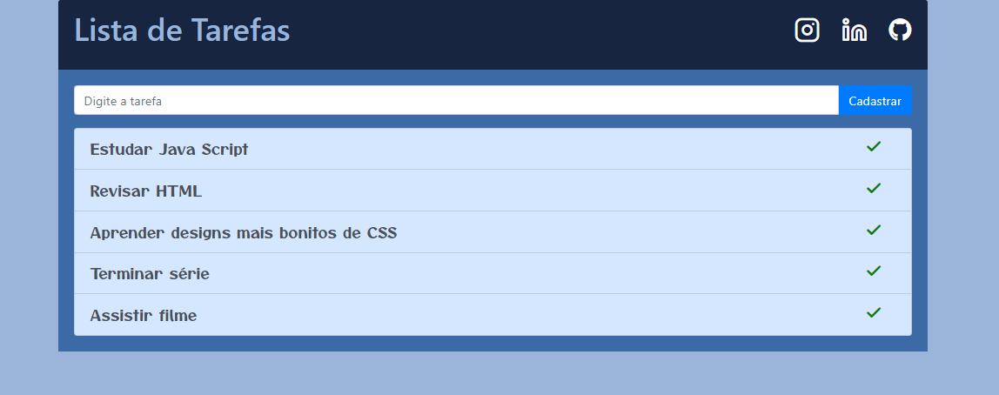

# Lista de Tarefas - Geek University

  

## Um pouco do Projeto:

➡ Site de uma lista de tarefas, feito no curso de Java Script da Geek University, que foca na interação do site e tem a funcionalidade de salvar localmente, no storage do navegador, todas as tarefas adicionadas e com a opção de apagar com o duplo clique.

## Conteúdos

- [Overview](#overview)
  - [Como rodar o projeto](#como-rodar-o-projeto)
  - [Como utilizar](#como-utilizar-o-projeto)
  - [Screenshot](#screenshot)
  - [Links](#links)
- [Processo](#processo)
  - [Tecnologia utilizadas](#tecnologias-utilizadas)
  - [O que eu aprendi](#oque-eu-aprendi)
  - [Continuação do desenvolvimento](#continuacao-do-desenvolvimento)
  - [Recursos úteis](#recursos-uteis)
- [Autor](#autor)

## Overview

### Como rodar o projeto

 1. Primeiramente é necessário ter o node js instalado(caso não tenha, apenas baixe a pasta zip do projeto) 
 2. Clone o projeto com `git clone https://github.com/glsvitoria/lista-de-tarefas`
 3. Após clonar o projeto, basta apenas abrir o html principal do site e utilizar as suas funcionalidades

### Como utilizar

 1. Escreva a tarefa a ser adicionada na lista
 2. Clique no botão "Cadastrar" para salva-la no storage
 3. Quando completar a tarefa dê um duplo clique nela para apaga-la

### Screenshot

### Links
- Site hospedado: [Lista de Tarefas](link)

## Processo

### Tecnologias utilizadas:

### O que eu aprendi
 - Salvamento local dos dados
 - Trabalho com objetos para utilização de dados

## Autor
- Linkedin - [Guilherme Vitória](https://www.linkedin.com/in/glsvitoria/)
- GitHub - [glsvitoria](https://github.com/glsvitoria)
- Instagram - [glsvitoria](https://www.instagram.com/glsvitoria/)
